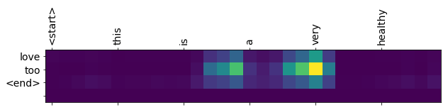

```python
# This Python 3 environment comes with many helpful analytics libraries installed
# It is defined by the kaggle/python docker image: https://github.com/kaggle/docker-python
# For example, here's several helpful packages to load in 

import numpy as np # linear algebra
import pandas as pd # data processing, CSV file I/O (e.g. pd.read_csv)

# Input data files are available in the "../input/" directory.
# For example, running this (by clicking run or pressing Shift+Enter) will list the files in the input directory
import tensorflow as tf
tf.enable_eager_execution()
import time
import re
import string
import os
print(os.listdir("../input"))
import matplotlib.pyplot as plt

# Any results you write to the current directory are saved as output.
```

    ['database.sqlite', 'hashes.txt', 'Reviews.csv']
    


```python
df = pd.read_csv('../input/Reviews.csv', delimiter = ',')
df.head()
```


<div>
<style scoped>
    .dataframe tbody tr th:only-of-type {
        vertical-align: middle;
    }

    .dataframe tbody tr th {
        vertical-align: top;
    }

    .dataframe thead th {
        text-align: right;
    }
</style>
<table border="1" class="dataframe">
  <thead>
    <tr style="text-align: right;">
      <th></th>
      <th>Id</th>
      <th>ProductId</th>
      <th>UserId</th>
      <th>ProfileName</th>
      <th>HelpfulnessNumerator</th>
      <th>HelpfulnessDenominator</th>
      <th>Score</th>
      <th>Time</th>
      <th>Summary</th>
      <th>Text</th>
    </tr>
  </thead>
  <tbody>
    <tr>
      <th>0</th>
      <td>1</td>
      <td>B001E4KFG0</td>
      <td>A3SGXH7AUHU8GW</td>
      <td>delmartian</td>
      <td>1</td>
      <td>1</td>
      <td>5</td>
      <td>1303862400</td>
      <td>Good Quality Dog Food</td>
      <td>I have bought several of the Vitality canned d...</td>
    </tr>
    <tr>
      <th>1</th>
      <td>2</td>
      <td>B00813GRG4</td>
      <td>A1D87F6ZCVE5NK</td>
      <td>dll pa</td>
      <td>0</td>
      <td>0</td>
      <td>1</td>
      <td>1346976000</td>
      <td>Not as Advertised</td>
      <td>Product arrived labeled as Jumbo Salted Peanut...</td>
    </tr>
    <tr>
      <th>2</th>
      <td>3</td>
      <td>B000LQOCH0</td>
      <td>ABXLMWJIXXAIN</td>
      <td>Natalia Corres "Natalia Corres"</td>
      <td>1</td>
      <td>1</td>
      <td>4</td>
      <td>1219017600</td>
      <td>"Delight" says it all</td>
      <td>This is a confection that has been around a fe...</td>
    </tr>
    <tr>
      <th>3</th>
      <td>4</td>
      <td>B000UA0QIQ</td>
      <td>A395BORC6FGVXV</td>
      <td>Karl</td>
      <td>3</td>
      <td>3</td>
      <td>2</td>
      <td>1307923200</td>
      <td>Cough Medicine</td>
      <td>If you are looking for the secret ingredient i...</td>
    </tr>
    <tr>
      <th>4</th>
      <td>5</td>
      <td>B006K2ZZ7K</td>
      <td>A1UQRSCLF8GW1T</td>
      <td>Michael D. Bigham "M. Wassir"</td>
      <td>0</td>
      <td>0</td>
      <td>5</td>
      <td>1350777600</td>
      <td>Great taffy</td>
      <td>Great taffy at a great price.  There was a wid...</td>
    </tr>
  </tbody>
</table>
</div>


```python
def preprocess_sentence(w):
    w = w.lower().strip()
    
    # creating a space between a word and the punctuation following it
    # eg: "he is a boy." => "he is a boy ." 
    # Reference:- https://stackoverflow.com/questions/3645931/python-padding-punctuation-with-white-spaces-keeping-punctuation
    w = re.sub(r"([?.!,¿])", r" \1 ", w)
    w = re.sub(r'[" "]+', " ", w)
    
    # replacing everything with space except (a-z, A-Z, ".", "?", "!", ",")
    w = re.sub(r"[^a-zA-Z?.!,¿]+", " ", w)
    
    w = w.rstrip().strip()
    
    # adding a start and an end token to the sentence
    # so that the model know when to start and stop predicting.
    w = '<start> ' + w + ' <end>'
    return w

clean_text = [preprocess_sentence(str(text)) for text in df['Text']]
clean_summaries = [preprocess_sentence(str(text)) for text in df['Summary']]

# 1. Remove the accents
# 2. Clean the sentences
# 3. Return word pairs in the format: [ENGLISH, SPANISH]
def create_dataset():    
    word_pairs = [[text, summary]  for text, summary in zip(clean_text, clean_summaries)]
    return word_pairs[:1000]

pairs = create_dataset()
pairs[:10]
```


    [['<start> i have bought several of the vitality canned dog food products and have found them all to be of good quality . the product looks more like a stew than a processed meat and it smells better . my labrador is finicky and she appreciates this product better than most . <end>',
      '<start> good quality dog food <end>'],
     ['<start> product arrived labeled as jumbo salted peanuts . . . the peanuts were actually small sized unsalted . not sure if this was an error or if the vendor intended to represent the product as jumbo . <end>',
      '<start> not as advertised <end>'],
     ['<start> this is a confection that has been around a few centuries . it is a light , pillowy citrus gelatin with nuts in this case filberts . and it is cut into tiny squares and then liberally coated with powdered sugar . and it is a tiny mouthful of heaven . not too chewy , and very flavorful . i highly recommend this yummy treat . if you are familiar with the story of c . s . lewis the lion , the witch , and the wardrobe this is the treat that seduces edmund into selling out his brother and sisters to the witch . <end>',
      '<start> delight says it all <end>'],
     ['<start> if you are looking for the secret ingredient in robitussin i believe i have found it . i got this in addition to the root beer extract i ordered which was good and made some cherry soda . the flavor is very medicinal . <end>',
      '<start> cough medicine <end>'],
     ['<start> great taffy at a great price . there was a wide assortment of yummy taffy . delivery was very quick . if your a taffy lover , this is a deal . <end>',
      '<start> great taffy <end>'],
     ['<start> i got a wild hair for taffy and ordered this five pound bag . the taffy was all very enjoyable with many flavors watermelon , root beer , melon , peppermint , grape , etc . my only complaint is there was a bit too much red black licorice flavored pieces just not my particular favorites . between me , my kids , and my husband , this lasted only two weeks ! i would recommend this brand of taffy it was a delightful treat . <end>',
      '<start> nice taffy <end>'],
     ['<start> this saltwater taffy had great flavors and was very soft and chewy . each candy was individually wrapped well . none of the candies were stuck together , which did happen in the expensive version , fralinger s . would highly recommend this candy ! i served it at a beach themed party and everyone loved it ! <end>',
      '<start> great ! just as good as the expensive brands ! <end>'],
     ['<start> this taffy is so good . it is very soft and chewy . the flavors are amazing . i would definitely recommend you buying it . very satisfying ! ! <end>',
      '<start> wonderful , tasty taffy <end>'],
     ['<start> right now i m mostly just sprouting this so my cats can eat the grass . they love it . i rotate it around with wheatgrass and rye too <end>',
      '<start> yay barley <end>'],
     ['<start> this is a very healthy dog food . good for their digestion . also good for small puppies . my dog eats her required amount at every feeding . <end>',
      '<start> healthy dog food <end>']]


```python
# This class creates a word -> index mapping (e.g,. "dad" -> 5) and vice-versa 
# (e.g., 5 -> "dad") for each language,
class LanguageIndex():
  def __init__(self, lang):
    self.lang = lang
    self.word2idx = {}
    self.idx2word = {}
    self.vocab = set()
    
    self.create_index()
    
  def create_index(self):
    for phrase in self.lang:
      self.vocab.update(phrase.split(' '))
    
    self.vocab = sorted(self.vocab)
    
    self.word2idx['<pad>'] = 0
    for index, word in enumerate(self.vocab):
      self.word2idx[word] = index + 1
    
    for word, index in self.word2idx.items():
      self.idx2word[index] = word
```


```python
def max_length(tensor):
    return max(len(t) for t in tensor)


def load_dataset():
    # creating cleaned input, output pairs
    pairs = create_dataset()

    # index language using the class defined above    
    inp_lang = LanguageIndex(text for text, summary in pairs)
    targ_lang = LanguageIndex(summary for text, summary in pairs)
    
    # Vectorize the input and target languages
    
    # Spanish sentences
    input_tensor = [[inp_lang.word2idx[s] for s in text.split(' ')] for text, summary in pairs]
    
    # English sentences
    target_tensor = [[targ_lang.word2idx[s] for s in summary.split(' ')] for text, summary in pairs]
    
    # Calculate max_length of input and output tensor
    # Here, we'll set those to the longest sentence in the dataset
    max_length_inp, max_length_tar = max_length(input_tensor), max_length(target_tensor)
    
    # Padding the input and output tensor to the maximum length
    input_tensor = tf.keras.preprocessing.sequence.pad_sequences(input_tensor, 
                                                                 maxlen=max_length_inp,
                                                                 padding='post')
    
    target_tensor = tf.keras.preprocessing.sequence.pad_sequences(target_tensor, 
                                                                  maxlen=max_length_tar, 
                                                                  padding='post')
    
    return input_tensor, target_tensor, inp_lang, targ_lang, max_length_inp, max_length_tar
```


```python
input_tensor, target_tensor, inp_lang, targ_lang, max_length_inp, max_length_targ = load_dataset()
```


```python
input_tensor
```


    array([[   5, 2522, 2354, ...,    0,    0,    0],
           [   5, 3947,  277, ...,    0,    0,    0],
           [   5, 5227, 2663, ...,    0,    0,    0],
           ...,
           [   5, 5227, 4399, ...,    0,    0,    0],
           [   5, 3410, 2478, ...,    0,    0,    0],
           [   5, 2522, 2354, ...,    0,    0,    0]], dtype=int32)


```python
input_tensor.shape
```


    (1000, 1123)


```python
max_length_inp
```


    1123


```python
max_length_targ
```


    56


```python
from sklearn.model_selection import train_test_split

input_tensor_train, input_tensor_val, target_tensor_train, target_tensor_val = train_test_split(input_tensor, target_tensor, test_size=0.2)

# Show length
len(input_tensor_train), len(target_tensor_train), len(input_tensor_val), len(target_tensor_val)
```


    (800, 800, 200, 200)


```python
config = tf.ConfigProto(allow_soft_placement=True)
config.gpu_options.allocator_type = 'BFC'
config.gpu_options.per_process_gpu_memory_fraction = 0.80

BUFFER_SIZE = len(input_tensor_train)
BATCH_SIZE = 16
N_BATCH = BUFFER_SIZE//BATCH_SIZE
embedding_dim = 256
units = 256
vocab_inp_size = len(inp_lang.word2idx)
vocab_tar_size = len(targ_lang.word2idx)

dataset = tf.data.Dataset.from_tensor_slices((input_tensor_train, target_tensor_train)).shuffle(BUFFER_SIZE)
dataset = dataset.batch(BATCH_SIZE, drop_remainder=True)
```


```python
def gru(units):
  # If you have a GPU, we recommend using CuDNNGRU(provides a 3x speedup than GRU)
  # the code automatically does that.
  if tf.test.is_gpu_available():
    return tf.keras.layers.CuDNNGRU(units, 
                                    return_sequences=True, 
                                    return_state=True, 
                                    recurrent_initializer='glorot_uniform')
  else:
    return tf.keras.layers.GRU(units, 
                               return_sequences=True, 
                               return_state=True, 
                               recurrent_activation='sigmoid', 
                               recurrent_initializer='glorot_uniform')
```


```python

class Encoder(tf.keras.Model):
    def __init__(self, vocab_size, embedding_dim, enc_units, batch_sz):
        super(Encoder, self).__init__()
        self.batch_sz = batch_sz
        self.enc_units = enc_units
        self.embedding = tf.keras.layers.Embedding(vocab_size, embedding_dim)
        self.gru = gru(self.enc_units)
        
    def call(self, x, hidden):
        x = self.embedding(x)
        output, state = self.gru(x, initial_state = hidden)        
        return output, state
    
    def initialize_hidden_state(self):
        return tf.zeros((self.batch_sz, self.enc_units))
```


```python
class Decoder(tf.keras.Model):
    def __init__(self, vocab_size, embedding_dim, dec_units, batch_sz):
        super(Decoder, self).__init__()
        self.batch_sz = batch_sz
        self.dec_units = dec_units
        self.embedding = tf.keras.layers.Embedding(vocab_size, embedding_dim)
        self.gru = gru(self.dec_units)
        self.fc = tf.keras.layers.Dense(vocab_size)
        
        # used for attention
        self.W1 = tf.keras.layers.Dense(self.dec_units)
        self.W2 = tf.keras.layers.Dense(self.dec_units)
        self.V = tf.keras.layers.Dense(1)
        
    def call(self, x, hidden, enc_output):
        # enc_output shape == (batch_size, max_length, hidden_size)
        
        # hidden shape == (batch_size, hidden size)
        # hidden_with_time_axis shape == (batch_size, 1, hidden size)
        # we are doing this to perform addition to calculate the score
        hidden_with_time_axis = tf.expand_dims(hidden, 1)
        
        # score shape == (batch_size, max_length, hidden_size)
        score = tf.nn.tanh(self.W1(enc_output) + self.W2(hidden_with_time_axis))
        
        # attention_weights shape == (batch_size, max_length, 1)
        # we get 1 at the last axis because we are applying score to self.V
        attention_weights = tf.nn.softmax(self.V(score), axis=1)
        
        # context_vector shape after sum == (batch_size, hidden_size)
        context_vector = attention_weights * enc_output
        context_vector = tf.reduce_sum(context_vector, axis=1)
        
        # x shape after passing through embedding == (batch_size, 1, embedding_dim)
        x = self.embedding(x)
        
        # x shape after concatenation == (batch_size, 1, embedding_dim + hidden_size)
        x = tf.concat([tf.expand_dims(context_vector, 1), x], axis=-1)
        
        # passing the concatenated vector to the GRU
        output, state = self.gru(x)
        
        # output shape == (batch_size * 1, hidden_size)
        output = tf.reshape(output, (-1, output.shape[2]))
        
        # output shape == (batch_size * 1, vocab)
        x = self.fc(output)
        
        return x, state, attention_weights
        
    def initialize_hidden_state(self):
        return tf.zeros((self.batch_sz, self.dec_units))
```


```python
encoder = Encoder(vocab_inp_size, embedding_dim, units, BATCH_SIZE)
decoder = Decoder(vocab_tar_size, embedding_dim, units, BATCH_SIZE)
```


```python
optimizer = tf.train.AdamOptimizer()


def loss_function(real, pred):
  mask = 1 - np.equal(real, 0)
  loss_ = tf.nn.sparse_softmax_cross_entropy_with_logits(labels=real, logits=pred) * mask
  return tf.reduce_mean(loss_)
```


```python
import os
checkpoint_dir = './training_checkpoints'
checkpoint_prefix = os.path.join(checkpoint_dir, "ckpt")
checkpoint = tf.train.Checkpoint(optimizer=optimizer,
                                 encoder=encoder,
                                 decoder=decoder)
```


```python
EPOCHS = 10

for epoch in range(EPOCHS):
    start = time.time()
    
    hidden = encoder.initialize_hidden_state()
    total_loss = 0
    
    for (batch, (inp, targ)) in enumerate(dataset):
        loss = 0
        
        with tf.GradientTape() as tape:
            enc_output, enc_hidden = encoder(inp, hidden)
            
            dec_hidden = enc_hidden
            
            dec_input = tf.expand_dims([targ_lang.word2idx['<start>']] * BATCH_SIZE, 1)       
            
            # Teacher forcing - feeding the target as the next input
            for t in range(1, targ.shape[1]):
                # passing enc_output to the decoder
                predictions, dec_hidden, _ = decoder(dec_input, dec_hidden, enc_output)
                
                loss += loss_function(targ[:, t], predictions)
                
                # using teacher forcing
                dec_input = tf.expand_dims(targ[:, t], 1)
        
        batch_loss = (loss / int(targ.shape[1]))
        
        total_loss += batch_loss
        
        variables = encoder.variables + decoder.variables
        
        gradients = tape.gradient(loss, variables)
        
        optimizer.apply_gradients(zip(gradients, variables))
        
        if batch % 100 == 0:
            print('Epoch {} Batch {} Loss {:.4f}'.format(epoch + 1,
                                                         batch,
                                                         batch_loss.numpy()))
    # saving (checkpoint) the model every 2 epochs
    if (epoch + 1) % 2 == 0:
      checkpoint.save(file_prefix = checkpoint_prefix)
    
    print('Epoch {} Loss {:.4f}'.format(epoch + 1,
                                        total_loss / N_BATCH))
    print('Time taken for 1 epoch {} sec\n'.format(time.time() - start))
```

    Epoch 1 Batch 0 Loss 0.3672
    Epoch 1 Loss 0.5307
    Time taken for 1 epoch 72.4614417552948 sec
    
    Epoch 2 Batch 0 Loss 0.4745
    Epoch 2 Loss 0.5057
    Time taken for 1 epoch 72.61180472373962 sec
    
    Epoch 3 Batch 0 Loss 0.4202
    Epoch 3 Loss 0.4869
    Time taken for 1 epoch 72.01322841644287 sec
    
    Epoch 4 Batch 0 Loss 0.4487
    Epoch 4 Loss 0.4727
    Time taken for 1 epoch 72.1374442577362 sec
    
    Epoch 5 Batch 0 Loss 0.2884
    Epoch 5 Loss 0.4598
    Time taken for 1 epoch 71.90825891494751 sec
    
    Epoch 6 Batch 0 Loss 0.4335
    Epoch 6 Loss 0.4432
    Time taken for 1 epoch 72.37527394294739 sec
    
    Epoch 7 Batch 0 Loss 0.6162
    Epoch 7 Loss 0.4292
    Time taken for 1 epoch 72.12824058532715 sec
    
    Epoch 8 Batch 0 Loss 0.5227
    Epoch 8 Loss 0.4122
    Time taken for 1 epoch 72.04292917251587 sec
    
    Epoch 9 Batch 0 Loss 0.3677
    Epoch 9 Loss 0.3947
    Time taken for 1 epoch 71.8166389465332 sec
    
    Epoch 10 Batch 0 Loss 0.3225
    Epoch 10 Loss 0.3772
    Time taken for 1 epoch 72.27637434005737 sec
    
    


```python
def evaluate(sentence, encoder, decoder, inp_lang, targ_lang, max_length_inp, max_length_targ):
    attention_plot = np.zeros((max_length_targ, max_length_inp))
    
    sentence = preprocess_sentence(sentence)

    inputs = [inp_lang.word2idx[i] for i in sentence.split(' ')]
    inputs = tf.keras.preprocessing.sequence.pad_sequences([inputs], maxlen=max_length_inp, padding='post')
    inputs = tf.convert_to_tensor(inputs)
    
    result = ''

    hidden = [tf.zeros((1, units))]
    enc_out, enc_hidden = encoder(inputs, hidden)

    dec_hidden = enc_hidden
    dec_input = tf.expand_dims([targ_lang.word2idx['<start>']], 0)

    for t in range(max_length_targ):
        predictions, dec_hidden, attention_weights = decoder(dec_input, dec_hidden, enc_out)
        
        # storing the attention weigths to plot later on
        attention_weights = tf.reshape(attention_weights, (-1, ))
        attention_plot[t] = attention_weights.numpy()

        predicted_id = tf.multinomial(predictions, num_samples=1)[0][0].numpy()

        result += targ_lang.idx2word[predicted_id] + ' '

        if targ_lang.idx2word[predicted_id] == '<end>':
            return result, sentence, attention_plot
        
        # the predicted ID is fed back into the model
        dec_input = tf.expand_dims([predicted_id], 0)

    return result, sentence, attention_plot
```


```python
# function for plotting the attention weights
def plot_attention(attention, sentence, predicted_sentence):
    fig = plt.figure(figsize=(10,10))
    ax = fig.add_subplot(1, 1, 1)
    ax.matshow(attention, cmap='viridis')
    
    fontdict = {'fontsize': 14}
    
    ax.set_xticklabels([''] + sentence, fontdict=fontdict, rotation=90)
    ax.set_yticklabels([''] + predicted_sentence, fontdict=fontdict)

    plt.show()
```


```python
def summarize(sentence, encoder, decoder, inp_lang, targ_lang, max_length_inp, max_length_targ):
    result, sentence, attention_plot = evaluate(sentence, encoder, decoder, inp_lang, targ_lang, max_length_inp, max_length_targ)
        
    print('Input: {}'.format(sentence))
    print(': {}'.format(result))
    
    attention_plot = attention_plot[:len(result.split(' ')), :len(sentence.split(' '))]
    plot_attention(attention_plot, sentence.split(' '), result.split(' '))
    return result
```


```python
summarize('this is a very healthy dog food . good for their digestion . also good for small puppies . my dog eats her required amount at every feeding',
          encoder, 
          decoder, 
          inp_lang, 
          targ_lang, 
          max_length_inp, 
          max_length_targ)

```

    Input: <start> this is a very healthy dog food . good for their digestion . also good for small puppies . my dog eats her required amount at every feeding <end>
    : love too <end> 
    





    'love too <end> '


